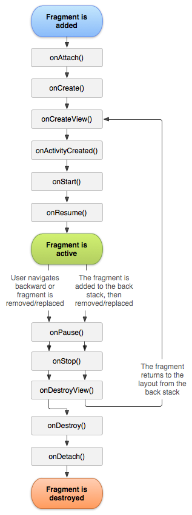

% MAD - Android 1: Activities & Fragments
% Patrick Sturm
% 16.10.2017

## Information

* Any issues with this presentation? Write a ticket or send me a pull request ;).
* Repo: [https://github.com/siyb/tw-mad-1-activities-and-fragments](https://github.com/siyb/tw-mad-1-activities-and-fragments)

# Agenda

## Agenda

* Introduction
* Android Fundamentals
* Introduction: Components
* Activity
* Fragments

# Introduction

## Introduction - 1 - About Me

* Let me start
    * Patrick Sturm
    * Current employeed as the CEO of Spherical Elephant GmbH
* Contact:
    * Email: sturm@technikum-wien.at
    * Work: p.sturm@sphericalelephant.com
* We do offer / can organize internships!

## Introduction - 2 - About this course

* Android Components
    * Services
    * Activities
    * ContentProvider
    * BroadcastReceiver
* AndroidManifest
* Providing Resources
* UI Stuff
* Advanced Topics (depending on remaining time NFC, Maps, GPS, …)

## Introduction - 3 - What do you need?

* [Android Studio](https://developer.android.com/studio/index.html)
* Patience, self control and strong nerves :P

# Android Fundamentals

## Android Fundamentals - 1 - Components

* Android is component based (we will learn a lot more about that later)
* Activities, Services, ContentProviders, BroadcastReceiver
* Components can run in the foreground, meaning that they are visible to the user (like Activities) ...
* ... they can also run in the background, performing heavy lifting (like Services)

## Android Fundamentals - 2 - Environment

* AndroidManifest.xml compiles application
    * Components are registered / arranged
    * Permissions are defined
    * Device / SDK restrictions
* Strings, colors, styles, layouts, some GFX, animations, etc. can be defined using XML
* Android design resembles MVC (separation of datamodel, view and controller)
    * There are other approaches now that use similar concepts like MVVM (Model-View-View-Model) and MVP (Model-View-Presenter)

## Android Fundamentals - 3 - Signature

* Applications are digitally signed
    * Android Studio provides a debug keystore, meaning that we can start right away \\o/
* When releasing multiple apps, sign them with the same key
* If using Google APIs (such as maps), you will need to register an account + signature to get a matching API key

# Introduction: Components

## Introduction: Components - 1 - Overview


## Introduction: Components - 2 - Basics

* Basically, you do not develop Applications, you develop Components that can be assembled into applications
* You can provide components to other applications (more on that later)
* All components that are used in you application need to be registered with the Android system
    * That’s where the AndroidManifest.xml file comes into play
    * AndroidManifest.xml controls more than that: styles, permissions, …

## Introduction: Components - 3 - Lifecycles

* Android SDK devs are crazy about lifecycles, all components have one
* The lifecycle of a component is controlled by the Android system ...
* ... but we receive feedback by implementing certain lifecycle feedback methods
    * This is called IOC (Inversion Of Control) - classic framework stuff
* Most callback methods need to invoke their super method, if they don't, a nasty exception will be thrown

# 

# Activity

## Activity - 1 - Resources

* Lesson(s): 
    * [http://developer.android.com/guide/topics/fundamentals/activities.html](http://developer.android.com/guide/topics/fundamentals/activities.html)
    * [https://developer.android.com/training/basics/activity-lifecycle/index.html](https://developer.android.com/training/basics/activity-lifecycle/index.html)
* Javadoc: [http://developer.android.com/reference/android/app/Activity.html](http://developer.android.com/reference/android/app/Activity.html)
* MISC: [http://developer.android.com/guide/topics/resources/providing-resources.html](http://developer.android.com/guide/topics/resources/providing-resources.html)

## Activity - 2 - Basics

* Simply put: Activities are the android component that a user will be able to see
* Activities are Components, they need to be registered in AndroidManifest.xml
* The visible part of an Activity is created from a layout file, which is composed of XML
* Java code can (and really should) be used to bind views and register callbacks
* Activities are stacked, meaning that creating an Activity within another Activity will place the newly created Activity on top of the Activity stack

## Activity - 3 - AndroidManifest

* Since we want our Activity to launch when the launcher icon is pressed, we need to define corresponding Intent filters
    * We will learn more about Intents and Intent filters later, just bear with me here ;)
* In this case, we define two Intent filters android.intent.action.MAIN and android.intent.category.LAUNCHER
    * android.intent.category.LAUNCHER: Activity is listed in the top level launcher and can be the start Activity
    * android.intent.action.MAIN: starts up the Activity as the initial Activity of our task

## Activity - 4 - AndroidManifest cont.

```xml
<activity android:name=".MyFirstActivity" 
  android:icon="@drawable/app_icon"> 
  <intent-filter> 
    <action 
      android:name="android.intent.action.MAIN" /> 
    <category 
      android:name="android.intent.category.LAUNCHER" /> 
  </intent-filter> 
</activity>
```

## Activity - 5 - Lifecycle


## Activity - 6 - Lifecycle Methods

* onCreate() - called when Activity is first created
* onStart() - called before Activity is visible
* onResume() - called when Activity is ready to receive user input -> on top of the stack now
    * Bind to services, etc
* onPause() - called before the Activity is paused, e.g. when new Activity is about to start
    * Persist data here (if there is non-persisted data)
    * Unbind services, etc
        * Activity becomes killable in pre honeycomb (can be killed without further notice - save your work)
* onStop() - Activity is no longer visible
    * Activity becomes killable in honeycomb+ versions
* onDestroy() - Activity is destroyed

## Activity - 7 - Code Example

```java
public class MyFirstActivity extends Activity { 
  private TextView textView;
  @Override public void onCreate(Bundle b) { 
    super.onCreate(b); 
    // inflating the layout 
    setContentView(R.layout.activity_myactivity); 
    // this is an unsafe cast, we can ignore that since 
    // we know which view will be returned. If we make 
    // changes to the layout, we need to adjust this line 
    // as well! 
    textView = (TextView) findViewById(R.id.myTextView); 
  } 
  @Override public void onPause() { 
    super.onPause();
    textView.setText("Hello World has been paused before!"); 
  } 
} 
```

## Activity - 8 - Layouts

* Layouts have to be placed in the res/ directory of the project
* The default folder is res/layout but ...
    * ... you may have layout folders for different orientations / screen sizes / dpi (dots per inch) and even Android versions
        * e.g. layout-port for portrait orientation, layout-small for small screens and layout-port-hdpi for portrait layouts on a hdpi display
        * Refer to [this link](https://developer.android.com/guide/topics/resources/providing-resources.html) for a full list of supported modes and their naming order

## Activity - 9 - Layouts cont.

* XML is used to describe the layout
    * The Android tool-chain will compile all XML resource files into a binary XML format to speed things up at runtime
    * Layout will be inflated from binary XML files
* The hierarchical layout of the XML files defines the view hierarchy
    * Layouts can be composed of Views and/or ViewGroups
* ViewGroups are essentially Views that can contain other Views
    * Views are things like buttons, sliders, dropdown menus, etc.

## Activity - 10 - Layouts cont.

* ViewGroups are used to arrange containing Views in a certain manner (LinearLayout vs RelativeLayout vs ...)
    * ViewGroups and Views can be customized using attributes
* Don't worry though, Android Studio features an UI builder and code completion for most attributes
* Each View/ViewGroup may have an ID using the android:id attribute. CAREFUL IDs do not have to be unique!


## Activity - 11 - Layouts cont.

* Each View/ViewGroup may have multiple tags (android:tag), as IDs, tags are not unique!
* Tags / IDs may be used to access the corresponding view from Java code

## Activity - 12 - Layouts XML

```xml
<?xml version="1.0" encoding="utf-8"?> 
<!-- ViewGroup --> 
<LinearLayout 
  xmlns:android=
    "http://schemas.android.com/apk/res/android" 
  android:id="@+id/myLayout" 
  android:layout_width="match_parent" 
  android:layout_height="fill_parent" 
  android:orientation="vertical"> 
  <!-- View --> 
  <TextView
    android:id="@+id/myTextView" 
    android:text="Hello World!" 
  /> 
</LinearLayout>
```

## Activity 13 – Layouts cont.

* The name of the layout file will be used to access the layout in Java code
    *activity_myactivity will be accessible using the following static R.layout.activity_myactivity
* R is an autogenerated class that contains all resource identifiers, which we can use in our Java code
* Each view from out layout can be referred to by using R.id.<viewid>, example: R.id.myTextView

## Activity 14 - Working with Activities - 1

* Activities can be launched from Java code using Intents
    * We still need to declare them in our manifest though!
    * You may define additional information to your Activity within the Intent
* For now: An Intent is a data transport object that can store primitive data types (not all that it can store, but for now, that’s all you need to know)
* The code below starts our example Activity from code

```java
// this must be a context object! 
Intent i = new Intent(this, MyFirstActivity.class); 
i.putExtra(INTENT_EXTRA_SOMEEXTRAINFORMATION, true); 
startActivity(i);
```

## Activity 15 - Working with Activities - 2

* This is the onCreate() method of MyFirstActivity
* It gets the Intent we have used to start the Activity and prints the data we have specified.

```java
private static final String 
  INTENT_EXTRA_SOMEEXTRAINFORMATION = 
    "INTENT_EXTRA_SOMEEXTRAINFORMATION"; 
@Override public void onCreate(Bundle b) { 
  Intent startIntent = getIntent(); 
  if (startIntent
    .hasExtra(INTENT_EXTRA_SOMEEXTRAINFORMATION)) { 
    System.out.println("Extra was: " + startIntent
      .getBooleanExtra(INTENT_EXTRA_SOMEEXTRAINFORMATION); 
  } 
}
```

## Activity 16 - Working with Activities - 3

* Sometimes you want to launch an Activity in order to collect data from the user
    * e.g. make the user choose a picture from the gallery, which is shown in the Activity the request originated from
    * Android has facilities for this scenario, it uses startActivityForResult(...) and the onActivityResult(...) callback method
    * google heavily relies on this feature for several of its libraries
* You may use this mechanism to call Activities from other apps as well (e.g. sharing option)
    * == awesome since we can reuse components system wide + we can define components that will be used by the system (e.g. android.intent.action.SEND)

## Activity 17 - Working with Activities - 4

* Scenario: We have two Activities, RequestingActivity and GatheringActivity. RequestingActivity wants to get some user information, to do that it utilizes GatheringActivity
* “Algorithm”:
    * Start RequestingActivity
    * When the user needs to specify additional data: start GatheringActivity
    * As soon as the user provided the data, pass data to RequestingActivity
    * Close GatheringActivity

## Activity 18 - Working with Activities - 5

```java
public class RequestingActivity extends Activity { 
  public static final int OUR_REQUESTCODE = 0; 
  ... 
  startActivityForResult(
    new Intent(this, GatheringActivity.class), 
    OUR_REQUESTCODE); 
  ... 
  @Override protected void onActivityResult(
    int requestCode, 
    int resultCode, 
    Intent data) {
    if (resultCode == RESULT_OK && 
      requestCode == OUR_REQUESTCODE) { 
          // Do your stuff here 
    } 
  } 
}
```

## Activity 19 - Working with Activities - 6

```java
public class GatheringActivity extends Activity {
  // called by a button press event (for instance)
  public void handleUserRequest() { 
    // setting the result that will be 
    // delivered to the starting activity 
    setResult(RESULT_OK, new Intent());
    // terminates the activity 
    // and removes it from the stack 
    finish();
  } 
}
```

# Fragments

## Fragments - 1 - Resources

* Lesson: http://developer.android.com/guide/topics/fundamentals/fragments.html
* Javadoc:
    * [http://developer.android.com/reference/android/app/Fragment.html](http://developer.android.com/reference/android/app/Fragment.html)
    * [http://developer.android.com/reference/android/app/FragmentManager.html](http://developer.android.com/reference/android/app/FragmentManager.html)
    * [http://developer.android.com/reference/android/app/FragmentTransaction.html](http://developer.android.com/reference/android/app/FragmentTransaction.html)

## Fragments - 2 - Basics

* Fragments were introduced in honeycomb
    * but you can use them in older Android versions (and I suggest you do) -> support library!
* Their primary use is to fragment Activities for reuse purposes

## Fragments - 3 - Simple Usecase


## Fragments - 4 - Information

* Basically they are lightweight Activities (although fragments don't need to provide views)
* Fragments are no Android components but …
* … as Activities, they do have a lifecycle with similar methods as the ones present in Activities
* Unlike Activities, which are defined in the manifest and handled by the Android framework, Fragments are used like views (in layouts)
* Fragments may or may not define a layout

## Fragments - 5 - Information cont.

* The Fragment stack can be modified (not possible with the Activity)
* Fragments cannot be accessed the way you access views (no findViewById(...))
    * Android provides the FragmentManager for this reason (getFragmentManager() or getSupportFragmentManager())
* Using the Fragment implementation of honeycomb+ is slightly different than using the one provided by the support library
    * I suggest to use the implementation provided by the support library, so that you get bugfixes / new features

## Fragments - 6 - Lifecycle



## Fragments - 7 - Lifecylce Methods

* onCreate() - create essential components here
* onCreateView() - needs to return the view to be displayed in the Fragment (or null if you don't want your fragment to show a view)
* onPause() - called on first indication of user leaving Fragment

## Fragments - 8 - Transactions

* FragmentManager offers means to provide Fragment transactions
* Very similar to database transactions
    * A transaction can be started using the FragmentManager: getFragmentManager().beginTransaction();
    * Within the transaction, one can: show, hide, remove, replace, attach, detach, ... Fragments
    * Once you are done you need to use FragmentTransaction.commit(), to commit the changes you've made

* Transactions grant several freedoms:
    * You may decide to push a transaction to the backstack, essentially controlling how the user is guided trough your App (back button)
    * You may observe the backstack and react on changes
    * You may pop or only get an item from the backstack

## Fragments - 9 - Important Methods

* These methods should be used to check the Fragment’s internal state in order to avoid grave errors in your software
* isAdded() – check if the Fragment is currently added to its Activity
* isDetached() – check if the Fragment has been explicitly detached from the UI
* isRemoving() – check if the Fragment is currently being removed from the Activity
* isResumed() – most important method of all – check if the Fragment is in the resumed state (see lifecycle)
* isVisible() – check if the Fragment is currently visible to the user, DOES NOT WORK AS EXPECTED!

## Fragments - 12 - Fragment nesting

* As of Android 4.2, Fragment nesting finally works … (using a Fragment in another Fragment)
    * This wasn’t possible before and caused a lot of problems
    * Programmers could not work as modular as they wanted to
* Fragment nesting also works when you are using the support library
* Working with nested Fragments is kinda hacky, since Google did decide not to implement the feature when Fragments were introduced

## Fragments - 13 - Fragment nesting cont.

* Instead of using getFragmentManager() or getSupportFragmentManager() you will need to use getChildFragmentManager() to obtain an instance of FragmentManager!
* getChildFragmentManager() can only be called from within the Fragment, not an Activity
* Make sure to use getChildFragmentManager() (can’t stress this enough!) otherwise you will end up with strange behaviour that is extremely hard to debug…
* There is another downside…

## Fragments - 14 - Fragment nesting cont.

* [http://stackoverflow.com/questions/15207305/getting-the-error-java-lang-illegalstateexception-activity-has-been-destroyed/15656428#15656428](http://stackoverflow.com/questions/15207305/getting-the-error-java-lang-illegalstateexception-activity-has-been-destroyed/15656428#15656428)
* It seems that the newly added API is faulty, when detaching a nested Fragment (internal state is messed up)
* Check out the code snippet, it explains how to use reflections to clean up the state manually

# Any Questions?
